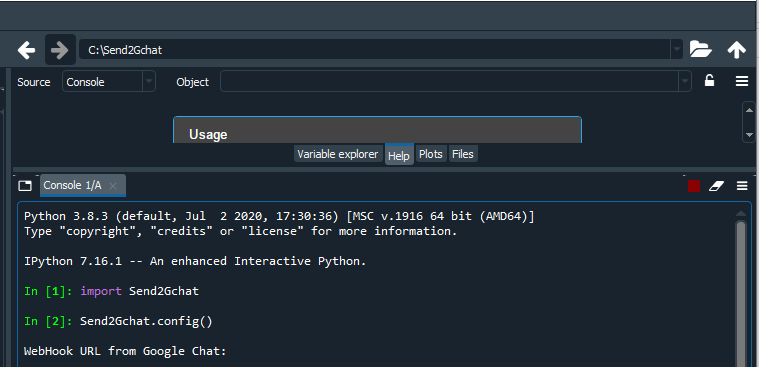

# Send2Gchat

This script will send the alert to your Google Chat group.

1- Requirement:

```
pip install httplib2
```

2 - To create the config.json with the configurations, you have to execute at the first time the Send2Gchat.config().

Tip: USE THE SPYDER IDE

>>> 
>>>
>>> Example

```
Python 3.8.3 (default, Jul  2 2020, 17:30:36) [MSC v.1916 64 bit (AMD64)]
Type "copyright", "credits" or "license" for more information.

IPython 7.16.1 -- An enhanced Interactive Python.

import Send2Gchat

Send2Gchat.config()

WebHook URL from Google Chat: https://chat.googleapis.com/v1/spaces/A...3D

This URL is correct (y/n)?
https://chat.googleapis.com/v1/spaces/A...3D
y

Do you have de thread URL (y/n): y

Thread URL:  spaces/A..../threads/....U

This URL is correct (y/n)?
spaces/A..../threads/....U
y

Path of Anaconda3
(Example: C:/ProgramData/Anaconda3)
>C:/ProgramData/Anaconda3
Path not founded!!!


Path of Anaconda3
(Example: C:/ProgramData/Anaconda3)
>C:\Users\khomp\anaconda3

PATH of activated.bat from Anaconda3
(Example: C:/ProgramData/Anaconda3/Scripts/activate.bat):
>C:\Users\khomp\anaconda3\Scripts\activate.bat
Setting URL: https://chat.googleapis.com/v1/spaces/A...3D
Anaconda3 PATH: C:\Users\khomp\anaconda3
activated.bat PATH: C:\Users\khomp\anaconda3\Scripts\activate.bat
```

The thread information will autofill with the first message sent if you no fill this information before.

For test, you could import IronDrive module:

```
from IronDrive import status

status('HELLO MARILENE!!!')
```

If everything is ok, you will receive this message in the respective group.

Tested on:
Anaconda3
Spyder 4.1.4
Python 3.8.3
